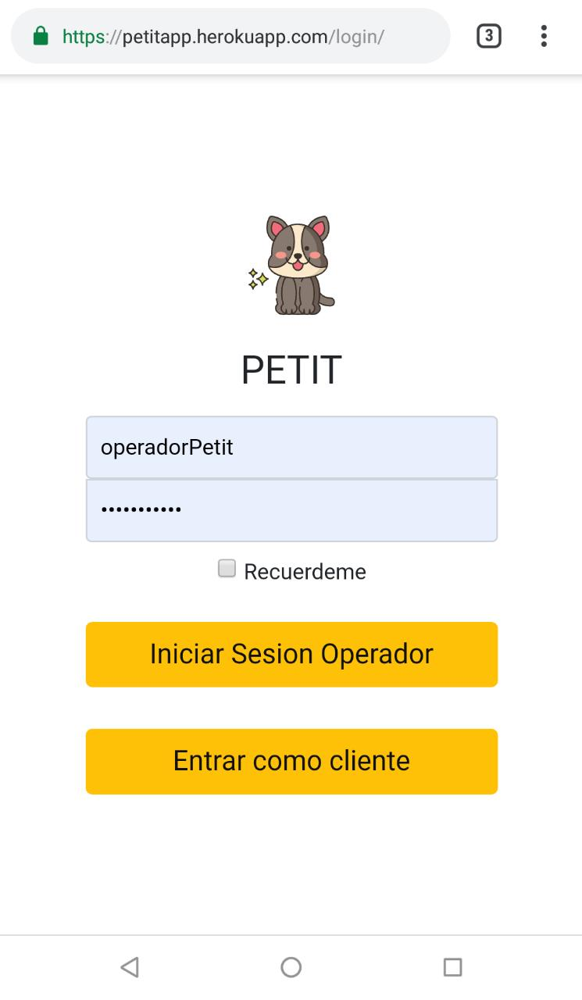

# PetIT :dog: :cat: : Minicomercio (Prueba Técnica TPaga)
Presentado por : María Camila Guerrero Giraldo.  
Petit es una tienda para mascotas y ofrece el pago de un único producto (Collar GPS Perros y Gatos). La aplicación fue desarrollada con Django y utilicé una plantilla de Html5Up.net que simula una tienda virtual.

## Tiempos estimados de trabajo
Las actividades de desarollo las organicé de la siguiente manera : 

1. Generación de Ideas del comercio y producto (30 min)
2. Selección y edición de plantilla HTML5 (30 min)
3. Lectura de la documentación de TPaga Api (2 horas)
4. Modelado de base de datos del aplicativo en PostgreSQL (1 hora)
5. Configuración básica del aplicativo Django : Esqueleto de Aplicaciones, Templates y Estáticos 
  5.1 Creacion de archivo para consumir la TPaga Api y codificar los métodos de solicitar, pagar, confirmar y revertir (3 horas)
  5.2 Definir las vistas para listar los productos del Comercio (30 minutos)
  5.3 Definir las vistas para que el comercio haga las solicitudes a la TPaga Api  ( 10 horas ) 
6. Pulir y limpiar el código (1 hora)
7. Autenticación (1 hora)
8. Despliegue en Heroku (4 horas)
  
## Tiempos reales de trabajo
Las actividades las desarrollé de la siguiente manera : 

1. Generación de Ideas del comercio y producto (30 min)
2. Selección y edición de plantilla HTML5 (1 hora)
3. Lectura de la documentación de TPaga Api (2 horas)
4. Modelado de base de datos del aplicativo en PostgreSQL (1 hora)
5. Configuración básica del aplicativo Django : Esqueleto de Aplicaciones, Templates y Estáticos 
  5.1 Creacion de archivo para consumir la TPaga Api y codificar los métodos de solicitar, pagar, confirmar y revertir (3 horas)
  5.2 Definir las vistas para listar los productos del Comercio (30 minutos)
  5.3 Definir las vistas para que el comercio haga las solicitudes a la TPaga Api  ( 14 horas ) 
6. Pulir y limpiar el código (1 hora)
7. Autenticación (1 hora)
8. Despliegue en Heroku (6 horas)

### Observaciones :
- Las primeras pruebas con la API se hicieron con la herramienta Postman
- Se usó un servidor ssl para poder hacer peticiones a la API desde el aplicativo de manera local
- Al hacer pruebas desde el celular se observó que el tpaga_payment_url redirigia a la Play Store y no al app de staging (Se preguntó por Slack)  y a pesar de que se usaba el navegador Google Chrome, seguia redirigiendo a la Play store

## Funcionamiento del aplicativo

    

- Login del aplicativo: El login aplica para un operador del comercio con los datos de autenticación que se proveen más adelante. Para entrar como cliente no es necesario autenticarse y debe dar clic sobre el botón *Entrar como cliente*   
- Página principal del comercio : En la página principal del comercio se muestra un slider con una "Nueva colección", justo en ese slider hay un botón que dice "Compralos Ya" , este botón redirige al template para adquirir un producto , el único producto disponible es un Collar GPS para perros y gatos. Se escoge la cantidad de productos que se quieren adquirir y finalmente se da clic en el botón de "Solicitar Pago" .  

    

- Página de Pagar Productos : En este template se ve el detalle de la orden realizada y el botón "Pagar" ,que redirije a la aplicación de la billetera.  
- Billetera TPaga  
- Página de Confirmación de Pago : En esta página se observa una pequeña factura con la información del pago realizado.  

    

- Página de consulta Transacciones : Si se accede como cliente ,solicitará que se loggee en el sistema como operador , ya que esta operación es exclusiva para los operadores del comercio . Cuando se autentique , se observará una tabla con las transacciones del comercio y su respectiva información , en la última columna se tiene la posibilidad de Revertir la transacción una vez ya esté pagada.  
- Página de Revertir Transacción : Cuando se revierte la transacción desde la página de consulta de Transacciones , esta redirige a un template que confirma si se revirtió la transacción.  

## Tabla de URLs
Función | URL
------------ | -------------
Inicio | https://petitapp.herokuapp.com/
Login | https://petitapp.herokuapp.com/login/
Compra Producto | https://petitapp.herokuapp.com/petit/productos
Pagar Orden | https://petitapp.herokuapp.com/petit/pagarOrden/*idOrden*
Confirmación del Pago | https://petitapp.herokuapp.com/petit/confirmarPago/*idOrden*
Consulta Transacciones (Login) | https://petitapp.herokuapp.com/petit/consultarTransacciones
Revertir Orden (Login) | https://petitapp.herokuapp.com/petit/revertirTransaccion

## Autenticación

Para autenticarse en la aplicación como un operador del comercio Petit , entre al aplicativo con las credenciales

**Usuario** *operadorPetit*  
**Contraseña** *operador123*

El operador de Petit puede ver las transacciones del comercio y por ende revertir alguna de estas transacciones. 
## Mejoras

* Añadir en los JSON de purchase_items una key "quantity" para manejar detalles de Ordenes en vez de crear varios JSON por cada objeto adquirido cuando son de la misma referencia.

## Despliegue
Desplegué el aplicativo en Heroku, este proceso me tomó mucho tiempo porque nunca había realizado despliegues en esta plataforma, sin embargo , despues de mucho practicar siento que entiendo el proceso y me motiva a realizar otros despliegues aquí . 

El aplicativo se encuentra disponible en : https://petitapp.herokuapp.com/

## Recomendaciones para TPaga
- ¿Qué sitio de plantillas de internet gratuitas nos recomendaría?
  Personalmente he trabajado con algunos sitios con plantillas gratuitas responsive como:

  * https://devdap.com/django-templates/ - Sitio web de código abierto con plantillas con licencia MIT.
  * https://colorlib.com/wp/free-bootstrap-ecommerce-website-templates/ - Blog con múltiples plantillas gratuitas e-commerces.
  * https://webflow.com/free-website-templates/ - Plantillas gratuitas para diseñadores, empresas y uso personal.

- ¿Qué sitios para alojar la infraestructura recomendaría a otros aspirantes a esta u
otras pruebas en Tpaga?

  Recomendaria los siguientes sitios
  - https://www.pythonanywhere.com/ . Lo he usado en el tutorial de DjangoGirls y me parece que es una herramienta amigable en los primeros despliegues que se hagan con Python.
  - https://www.alwaysdata.com/en/
  - https://www.openshift.com/ . Redhat
  - https://cloud.google.com/ . Hago énfasis en este ya que los servicios cloud de Google están en auge en este momento y aprender sobre esto es un extra para los desarrolladores . Sin embargo, es pago. 

- ¿Qué libros recomendaría para que las personas que están en el equipo de trabajo
puedan leer y cuenten con las mejores prácticas de vida y desarrollo?

  Hay 3 libros que considero vitales para aprender y mejorar las prácticas . Entre estos están :

  * PEP 8 -- Style Guide for Python Code
    - Guía de estilo para el código Python. Esta guia tiene recomendaciones para organizar el código y hacerlo más entendible para otras personas.
  * https://djangobook.com/the-django-book/
    - Sitio con una guía práctica de Django, además esta en proceso de construcción de un libro para entender y dominar Django 2.
  * Two Scoops of Django 1.11: Best Practices for the Django Web Framework . Escuché de este libro en la PyCon Colombia 2018 . Sus autores fueron keynotes y ofrecieron una charla muy interesante sobre CookieCuter, rifaron algunos de estos libros y tuve la oportunidad de conseguirlo prestado . Me parece que tiene buen material y como muchas otras personas interesadas en Django , estoy esperando nuevas ediciones para las versiones recientes de Django.
  
  - ¿Qué mejores prácticas compartiría con un desarrollador que admire o con el cual valdría la pena seguir trabajando y aprendiendo?

Le recomendaría a un desarrollador que admire que independientemente del lenguaje de programación del que guste, es importante comentarear el código y organizarlo para que una persona ajena a este lo entienda . Además le sugeriría que esté siempre leyendo mucho material bibliográfico y digital sobre sus intereses en el mundo de la programación . También que programe en un ambiente tranquilo , con calma y pensando previamente lo que va a hacer . Finalmente , una práctica que le recomendaría sería que empezara a revisar proyectos y código de sus conocidos, tratara de mejorarlos y hacer críticas constructivas a sus desarrolladores, ya que con este ejercicio se aprende en equipo y se adquieren skills en este campo.
